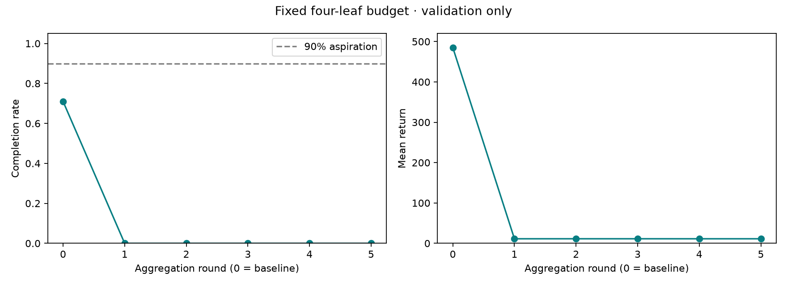

# Dataset aggregation: a failed improvement attempt

Five pre-specified rounds of learner-driven dataset aggregation did **not**
improve the four-leaf CartPole policy. The original model and demo remain the
recommended baseline. No extra tuning or tree-size increase followed final testing.

## Results on 500 matched fresh test episodes

| Policy | Mean return | Full completion |
|---|---:|---:|
| Original four-leaf tree | 485.49 | 68% |
| Aggregated four-leaf tree, selected round 2 | 11.75 | 0% |
| Neural teacher | 500.00 | 100% |

Round 2 was selected by highest validation completion, then highest mean return,
then earliest round for an exact tie. Every round had zero validation completions;
rounds 2 and 3 tied at mean 11.28. The baseline was never overwritten or promoted
away. The selected aggregated model is an experimental artifact, not an upgrade.

## Failure diagnosis

On 100 diagnostic episodes the original tree failed 35 times. All 35 failures
were track-boundary failures, with no pole-angle failures. The tree uses pole
angle and angular velocity and ignores cart position. Maintaining balance does
not necessarily keep the cart inside the allowed track.

The teacher disagreed with 41.32% of actions on tree-visited diagnostic states,
and with 36.86% of actions in the final 20 steps of failed episodes. Labels were
queried on the same state as the tree action, not on a separate teacher trajectory.
These are descriptive observations, not causal evidence about a particular action.

## Protocol

- Start with the original 80,000 training examples. Exclude all 20,000 original
  validation examples from fitting.
- Run 50 learner-controlled episodes per round; query the frozen teacher for
  action labels at every visited state, but execute the learner's actions.
- Append every new example with equal weight, then fit a depth-2 decision tree
  with random seed 2026. The budget stays at four leaves.
- Repeat five rounds, selecting on 100 fixed validation episodes.
- Freeze the selection before comparing baseline, selected tree, and teacher
  on 500 untouched test reset seeds.

| Round | Added examples | Total examples | Validation mean | Completion |
|---|---:|---:|---:|---:|
| 1 | 24,295 | 104,295 | 11.25 | 0% |
| 2 | 555 | 104,850 | 11.28 | 0% |
| 3 | 586 | 105,436 | 11.28 | 0% |
| 4 | 577 | 106,013 | 11.25 | 0% |
| 5 | 563 | 106,576 | 11.25 | 0% |



Diagnostic seeds start at 10,000,000; collection rounds at 11,001,000 through
11,005,000, with 50 episodes per block; validation at 12,000,000; final testing
at 13,000,000. These ranges are disjoint from one another and earlier experiments.

## What changed in the learned rules

The selected aggregated policy replaced a redundant split in the baseline's
left subtree with a cart-position split. That also changed the chosen action
for some states near the initial conditions. The full learned policy performed
poorly despite including a potentially relevant feature.

The initial aggregation round introduced 24,295 new examples, but the failing
learners subsequently survived only about 11 steps, supplying fewer than 600
examples per round. Those later batches were small relative to the existing
dataset. This is a plausible contributor to stalled recovery, not a demonstrated
sole cause. The result does not show that DAgger generally fails or that four
leaves can never work. It covers one pure-learner, uniformly weighted protocol
and one fitting seed.

## Artifacts and demo

Open `demo-aggregation/index.html` for an **Original / Aggregated (worse)**
selector. Each variant shows teacher versus tree on identical selected example
seeds. There was no baseline-failure/aggregated-success example in the test.
The original `demo/index.html` remains unchanged.

`runs/dagger-v1/` contains all five models and rule files, labeled collection
batches, diagnostic failure tails, per-episode validation/test results,
source snapshots, package versions, and input checksums. The complete generated
report is `runs/dagger-v1/REPORT.md`.

```powershell
# Rerun the pre-specified experiment in a new directory.
.\.venv\Scripts\python.exe dagger.py --output runs/dagger-reproduction

# Rebuild only the comparison demo from the existing results.
.\.venv\Scripts\python.exe record_aggregation_demo.py

# Check learner execution versus teacher labeling, and selection ordering.
.\.venv\Scripts\python.exe test_dagger.py -v
```

The next controlled experiment could vary data weighting or introduce a mixture
of teacher and learner actions during collection, while retaining the same tree
size and a new held-out test set. That is a separate experiment, not a hidden
adjustment to these results.
