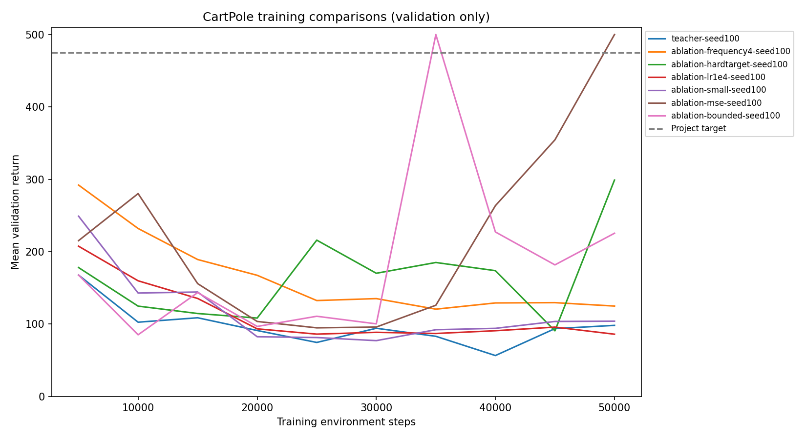
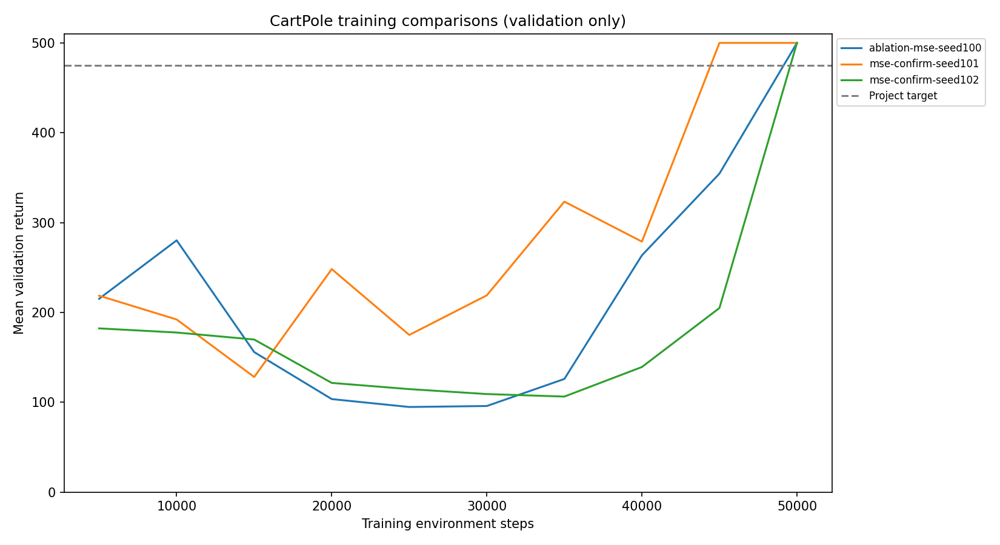

# CartPole teacher diagnosis and recovery

## Result

Changing the loss from Huber to mean-squared error (MSE), while retaining the
original network and update schedule, produced teachers scoring 500/500 across
100 fresh evaluation episodes each for three training seeds. MSE and a 50,000-step
budget are now the defaults. The trained seed-100 model is ready for collecting
action demonstrations; no new training run is necessary.

Selected checkpoint: `runs/ablation-mse-seed100/best.pt`.
Selection metadata: `runs/selected_teacher.json`.

```powershell
python cartpole.py evaluate runs/ablation-mse-seed100/best.pt --episodes 100 --seed 5000000
```

The command above performs another evaluation on a different set of seeds. It
does not recreate the recorded test, which used seeds starting at 4,000,000.

## What failed in the initial run

The initial Huber-loss run peaked at step 5,000 (validation mean 167.6), then
deteriorated. Its saved best checkpoint scored 161.4 on the original held-out
evaluation; the final checkpoint was much worse.

Diagnostics on 30 episodes starting at validation seed 1,000,000:

| Checkpoint | Mean return | Mean selected Q | Maximum selected Q | Failures |
|---|---:|---:|---:|---|
| Initial best | 169.13 | 19.08 | 20.88 | 30 pole-angle failures |
| Initial last | 35.20 | 240.70 | 265.57 | 30 pole-angle failures |
| MSE seed-100 best | 500.00 | 124.98 | 138.67 | 30 successful time limits |

CartPole gives +1 per step and training uses gamma=0.99, so the infinite-horizon
discounted return cannot exceed 1/(1-0.99)=100. The final initial model's values
were substantially inflated. The successful MSE teacher still overestimates
values: policy quality recovered, but value calibration is not solved. These
observations do not establish Q overestimation as the sole cause of failure.

The diagnostic values average over visited states, not equally over episodes.
Raw evidence is in `runs/baseline-diagnostics.json` and `runs/mse-diagnostics.json`.

## Controlled comparisons

All rows below use training seed 100, identical validation seeds, and the first
50,000 training environment steps. Each changes one factor relative to the initial
configuration. Checkpoints are evaluated every 5,000 steps on ten fixed episodes.

| Change | Best validation mean | Validation at 50,000 steps |
|---|---:|---:|
| Initial setup (Huber) | 167.6 | 98.1 |
| Learn every 4 steps instead of every step | 292.0 | 124.8 |
| Hard target copy every 1,000 steps instead of soft updates | 298.9 | 298.9 |
| Learning rate 0.0001 instead of 0.0003 | 207.5 | 85.9 |
| Hidden width 64 instead of 256 | 249.0 | 103.9 |
| **MSE instead of Huber** | **500.0** | **500.0** |
| Clip targets to valid return range [0, 100] | 500.0 | 225.4 |



The bounded-target trial continued to 100,000 steps; the table uses only the first
50,000 for equal-budget comparison. A separate combined candidate (width 64,
learning rate 0.001, updates every 4 steps, hard target copies every 1,000 steps)
ran for 100,000 steps and peaked at validation mean 302.0. This combined trial
does not isolate individual effects and was not chosen.

All tuning runs used `--skip-test`. MSE was selected before evaluating its fresh
test set. Huber is not generally a bad loss; this result supports MSE for this
implementation and experimental setup, not a universal ranking.

## Confirmation across independent training seeds

All three runs used two 256-unit hidden layers, Adam at 0.0003, batch size 64,
replay capacity 100,000, gamma 0.99, gradient clipping at norm 10, learning every
step after 1,000 warmup steps, and soft target updates with tau=0.005. Exploration
decayed from 1.0 to 0.05 over 30,000 post-warmup steps. Each trained for 50,000 steps.

| Training seed | Selected checkpoint step | Fresh test mean | Fresh test minimum | Episodes |
|---|---:|---:|---:|---:|
| 100 | 50,000 | 500.0 | 500 | 100 |
| 101 | 45,000 | 500.0 | 500 | 100 |
| 102 | 50,000 | 500.0 | 500 | 100 |

Fresh test reset seeds were 4,000,000 through 4,000,099, shared across the three
models for comparability and disjoint from validation and previous test sets.
No exploration was used during evaluation. Every episode reached the 500-step
time limit. Three seeds are a useful initial replication, not a guarantee for
all initializations, perturbed dynamics, or states outside the reset distribution.



Results live in each run's `fresh_test_results.json`. Seed 100 is in
`runs/ablation-mse-seed100`; seeds 101 and 102 are in `runs/mse-confirm-seed101`
and `runs/mse-confirm-seed102`. Training curves are not monotonic even in the
successful runs, which is why best-checkpoint saving remains important.

To reproduce the MSE configuration from the project folder:

```powershell
python cartpole.py train --seed 100 --steps 50000 --loss mse --skip-test --output runs/mse-reproduction-seed100
```

Use a new output directory for each run. Settings and source snapshots are saved
by the current trainer. The first exploratory runs predate source snapshots;
their config files do not include flags introduced later. For these runs,
omitted loss means Huber and omitted target bounding means disabled. The original
baseline also predates the configurable architecture and update schedule.

## Verification and next milestone

`python test_cartpole.py -v` checks exact Double DQN action selection and loss
targets, absence of target-network gradients, time-limit versus terminal replay
masks, target bounds, and reproducible initialization.

Next: freeze the selected teacher, collect observation/action demonstrations,
fit decision trees of several sizes, and evaluate the trees in the environment.
Start with action imitation; Q-value-weighted distillation needs extra care
because the teacher's values remain poorly calibrated.
