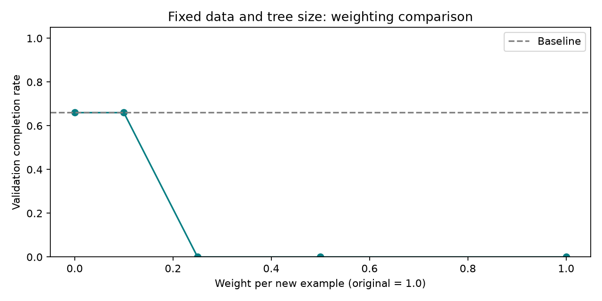

# Weighting new examples: collapse avoided, reliability unchanged

Giving each new example weight **0.1** preserved the four-leaf tree's control
performance, but did not improve its completion rate. The pre-specified gate
therefore stopped further aggregation. The original baseline remains recommended.

## Controlled first-round comparison

Every candidate used the same 80,000 original training examples and 24,295 saved
first-round learner-state examples. Original examples received weight 1.0; only
the weight of new examples changed. Depth was capped at 2 and fitting seed at
2026. All candidates were evaluated on 200 matched validation reset seeds
starting at 14,000,000.

| New-example weight | Validation mean | Completion | Cart-boundary failures | Pole-angle failures |
|---|---:|---:|---:|---:|
| 0.0 (control) | 483.40 | 66% | 68 | 0 |
| **0.1** | **483.55** | **66%** | **68** | **0** |
| 0.25 | 11.64 | 0% | 0 | 200 |
| 0.5 | 11.60 | 0% | 0 | 200 |
| 1.0 (control) | 11.59 | 0% | 0 | 200 |

Weight zero reproduced the saved original tree exactly, including full-precision
thresholds and actions. Weight one reproduced the failed first-round uniform
tree exactly. Both control checks passed before final testing.



## Selection and stopping decision

Among positive weights, choose highest validation completion, then highest mean
return, then smaller weight. This selected 0.1. Continue rounds 2–5 only if its
completion rate strictly improves over the baseline. Both were 66%, so no further
data was collected and no additional fitting rounds ran. The small validation
mean difference did not override the completion-rate gate.

## Final test: 500 untouched matched seeds

Selection was saved before evaluating reset seeds 16,000,000–16,000,499.

| Policy | Average return | Completion |
|---|---:|---:|
| Original tree | 485.20 | 66.8% |
| Weighted candidate, weight 0.1 | 485.12 | 66.8% |
| Neural teacher | 500.00 | 100% |

There is no measured completion improvement. The 0.08-point mean difference
does not establish a meaningful performance difference. This experiment supports
the narrower finding that a smaller new-data weight avoided the severe collapse
seen at larger tested weights for this dataset and fitting seed. It does not
show that weighting cannot help under other settings.

## Artifacts and demo

Open `demo-weighted/index.html` for **Original tree / Weighted candidate**
playback on identical selected seeds. Its aggregate statistics use this new
500-episode test. Earlier original and uniform-aggregation demos remain unchanged.

`runs/weighted-dagger-v1/` includes source snapshots, input checksums, both
control checks, all five tree models and rule files, complete validation/test
returns and failure counts, the continuation decision, selected model, plot,
and generated report. None of the original inputs was changed.

```powershell
# Repeat the fixed experiment into a new directory.
.\.venv\Scripts\python.exe weighted_dagger.py --output runs/weighted-reproduction

# Rebuild the weighted comparison demo from existing results.
.\.venv\Scripts\python.exe record_aggregation_demo.py --weighted

# Check weighting controls and candidate selection.
.\.venv\Scripts\python.exe test_weighted_dagger.py -v
node test_aggregation_demo.cjs --weighted
```

This is one dataset and fitting seed. Validation/test seed sets were new; the
original 20,000 action-validation examples never entered training. No tuning
followed test evaluation. Playback logic is checked with a mock DOM; browser
layout is not automatically verified.

## Implication for the next experiment

The small-weight candidate still fails by drifting beyond the track boundary.
A next experiment could explicitly study policy capacity or teacher/learner
mixing during collection. It should use a new protocol and untouched test seeds,
not quietly extend this completed comparison until a favorable result appears.
