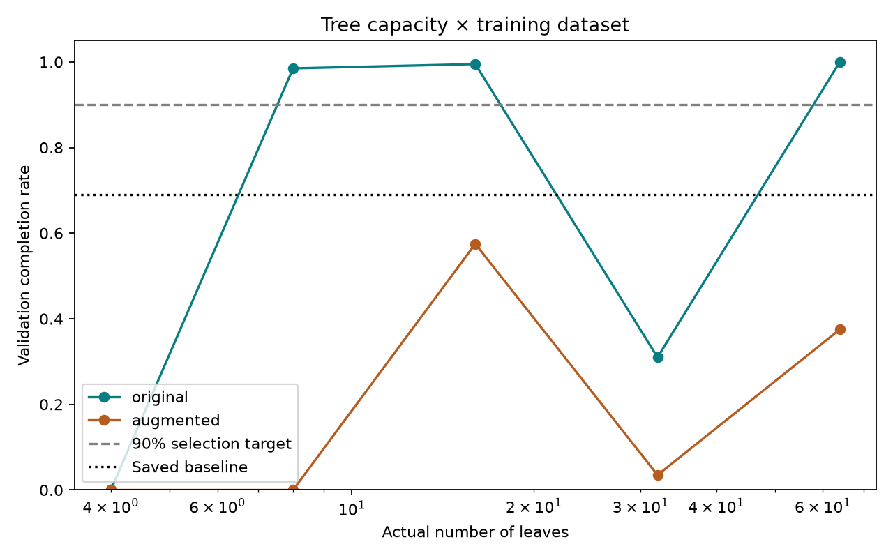

# Leaf-budget comparison

| Dataset | Budget | Actual leaves | Depth | Validation mean | Completion | Position failures | Angle failures |
|---|---:|---:|---:|---:|---:|---:|---:|
| original | 4 | 4 | 3 | 201.73 | 0.0% | 0 | 200 |
| original | 8 | 8 | 4 | 498.14 | 98.5% | 3 | 0 |
| original | 16 | 16 | 8 | 499.55 | 99.5% | 1 | 0 |
| original | 32 | 32 | 8 | 295.56 | 31.0% | 0 | 138 |
| original | 64 | 64 | 12 | 500.00 | 100.0% | 0 | 0 |
| augmented | 4 | 4 | 2 | 11.39 | 0.0% | 0 | 200 |
| augmented | 8 | 8 | 5 | 9.36 | 0.0% | 0 | 200 |
| augmented | 16 | 16 | 7 | 375.31 | 57.5% | 55 | 30 |
| augmented | 32 | 32 | 10 | 135.43 | 3.5% | 0 | 193 |
| augmented | 64 | 64 | 13 | 291.64 | 37.5% | 0 | 125 |

Selected original_8; validation target met: True. Saved baseline validation completion: 69.0%.

## Fresh test (500 matched episodes)

| Policy | Mean | Std | Minimum | Completion |
|---|---:|---:|---:|---:|
| baseline | 485.66 | 29.23 | 336 | 70.8% |
| capacity | 498.84 | 11.87 | 288 | 98.4% |
| teacher | 500.00 | 0.00 | 500 | 100.0% |

One dataset pair and fitting seed. New validation and test reset seeds. No post-test tuning. max_leaf_nodes uses best-first growth and differs from the previous max_depth cap. Original action-validation examples excluded from fitting.
