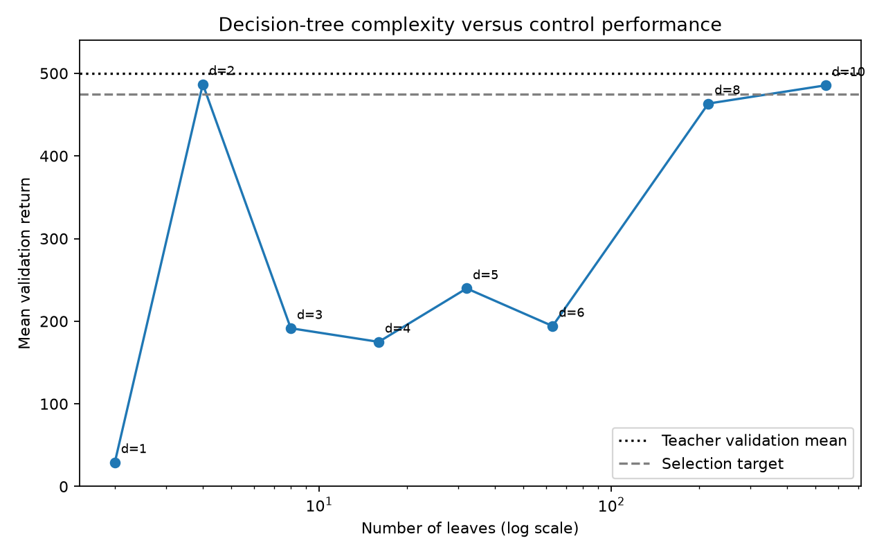
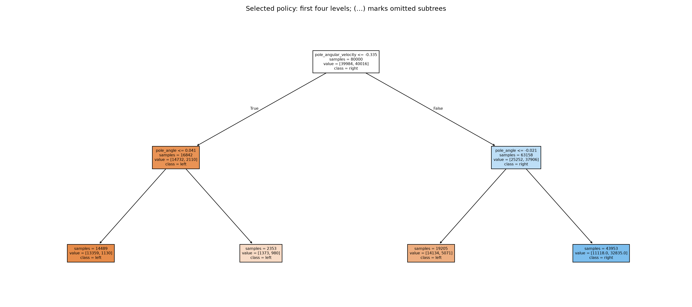

# Decision-tree distillation results

Collected 100,000 demonstrations from 200 frozen-teacher episodes.
Split: 160 training episodes (80,000 rows), 40 action-validation episodes (20,000 rows).

## Control validation

All candidates used the same fresh reset seeds, separate from demonstrations.

| Maximum depth | Leaves | Action agreement | Mean return | Return std | Completion |
|---|---:|---:|---:|---:|---:|
| 1 | 2 | 65.50% | 29.28 | 3.52 | 0% |
| 2 | 4 | 76.71% | 486.84 | 25.70 | 68% |
| 3 | 8 | 77.73% | 191.48 | 33.03 | 0% |
| 4 | 16 | 82.58% | 174.98 | 71.09 | 0% |
| 5 | 32 | 84.02% | 239.67 | 35.45 | 0% |
| 6 | 63 | 85.78% | 194.13 | 19.60 | 0% |
| 8 | 215 | 90.92% | 463.40 | 71.90 | 73% |
| 10 | 542 | 92.75% | 485.46 | 53.58 | 93% |

Selected depth 2, with 4 leaves.
The selected tree met the validation target.

## Fresh test (selection frozen beforehand)

Each policy used 100 episodes starting at seed 8,000,000.
Teacher: mean 500.00, std 0.00, completion 100%.
Tree: mean 483.41, std 31.27, completion 67%.

Completion requires reaching the 500-step time limit without physical failure.
Action agreement is measured on teacher-visited states; return measures the tree's own control.
One demonstration collection and one tree-fitting seed were used; uncertainty across datasets
is not measured. Return std describes episodes, not independent training runs.

The overview truncates deeper branches. Full rules are in selected_tree_rules.txt.
