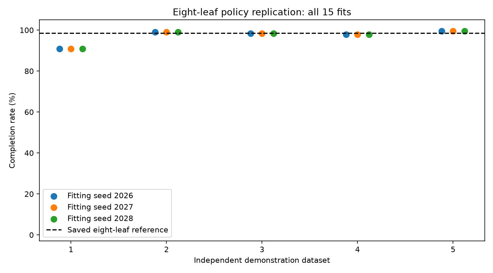

# Eight-leaf replication: all results

| Dataset | Fitting seed | Leaves | Depth | Mean return | Completion | Track failures | Pole failures |
|---|---:|---:|---:|---:|---:|---:|---:|
| 1 | 2026 | 8 | 4 | 492.69 | 90.8% | 46 | 0 |
| 1 | 2027 | 8 | 4 | 492.69 | 90.8% | 46 | 0 |
| 1 | 2028 | 8 | 4 | 492.69 | 90.8% | 46 | 0 |
| 2 | 2026 | 8 | 4 | 498.77 | 99.0% | 5 | 0 |
| 2 | 2027 | 8 | 4 | 498.77 | 99.0% | 5 | 0 |
| 2 | 2028 | 8 | 4 | 498.77 | 99.0% | 5 | 0 |
| 3 | 2026 | 8 | 4 | 497.79 | 98.4% | 8 | 0 |
| 3 | 2027 | 8 | 4 | 497.79 | 98.4% | 8 | 0 |
| 3 | 2028 | 8 | 4 | 497.79 | 98.4% | 8 | 0 |
| 4 | 2026 | 8 | 4 | 498.57 | 97.8% | 11 | 0 |
| 4 | 2027 | 8 | 4 | 498.57 | 97.8% | 11 | 0 |
| 4 | 2028 | 8 | 4 | 498.57 | 97.8% | 11 | 0 |
| 5 | 2026 | 8 | 4 | 499.25 | 99.6% | 2 | 0 |
| 5 | 2027 | 8 | 4 | 499.25 | 99.6% | 2 | 0 |
| 5 | 2028 | 8 | 4 | 499.25 | 99.6% | 2 | 0 |

## Dataset-level summary

| Dataset | Mean completion across fitting seeds | Range | Distinct trees |
|---|---:|---:|---:|
| 1 | 90.8% | 90.8%–90.8% | 1 |
| 2 | 99.0% | 99.0%–99.0% | 1 |
| 3 | 98.4% | 98.4%–98.4% | 1 |
| 4 | 97.8% | 97.8%–97.8% | 1 |
| 5 | 99.6% | 99.6%–99.6% | 1 |

Mean across the five dataset means: 97.1%; range 90.8%–99.6%. 5 distinct serialized policies among 15 fits.

Saved eight-leaf reference on the same 500 seeds: 98.6% completion, 499.30 mean return.
Teacher: 100.0% completion, 500.00 mean return.

## Interpretation limits

Five independent demonstration collections are the main replication units. Three fitting seeds within each dataset are not independent datasets; exact duplicate trees are not extra evidence.
All policies share 500 reset seeds, making evaluations paired. Episode outcomes across policies are not independent observations. No winning tree was selected and no tuning followed evaluation.
The frozen teacher, environment distribution, sample size, and fitting method are unchanged. This does not test changed physics, broader resets, or other teachers.
